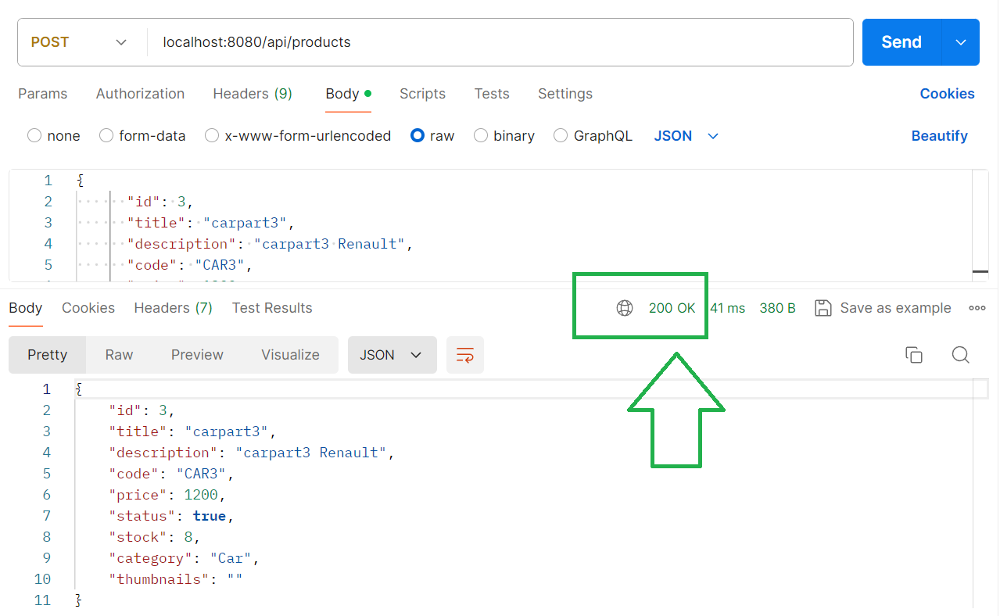

# Entregable Uno: E-commerce Carrito y Productos
Este proyecto es parte del entregable uno de un sistema de e-commerce que gestiona carritos de compras y productos mediante una API RESTful utilizando Node.js y Express.

## Descripción
El proyecto consiste en una aplicación que permite gestionar carritos de compras y productos mediante operaciones CRUD (Crear, Leer, Actualizar, Eliminar) a través de endpoints dedicados.

## Características Principales
Gestión de Carritos de Compras:

## Creación de nuevos carritos.
Adición y eliminación de productos en carritos.
Consulta de detalles de carritos específicos.
Gestión de Productos:

## Creación de nuevos productos.
Actualización y eliminación de productos existentes.
Consulta de detalles de productos específicos.
Tecnologías Utilizadas
Node.js: Entorno de ejecución para JavaScript.
Express: Framework web para Node.js.
Postman: Herramienta para probar endpoints de API REST.
JSON: Formato de intercambio de datos utilizado para almacenar carritos y productos.

## Uso
### Endpoints Disponibles

## Carritos:
GET /api/carts: Obtener todos los carritos.
GET /api/carts/:cid: Obtener un carrito específico por ID.
POST /api/carts: Crear un nuevo carrito.
DELETE /api/carts/:cid/product/:pid: Eliminar un producto de un carrito específico.

## Productos:
GET /api/products: Obtener todos los productos.
GET /api/products/:pid: Obtener un producto específico por ID.
POST /api/products: Crear un nuevo producto.
PUT /api/products/:pid: Actualizar un producto existente.
DELETE /api/products/:pid: Eliminar un producto específico.

.png)

.png)

.png)

.png)

.png)

.png)

